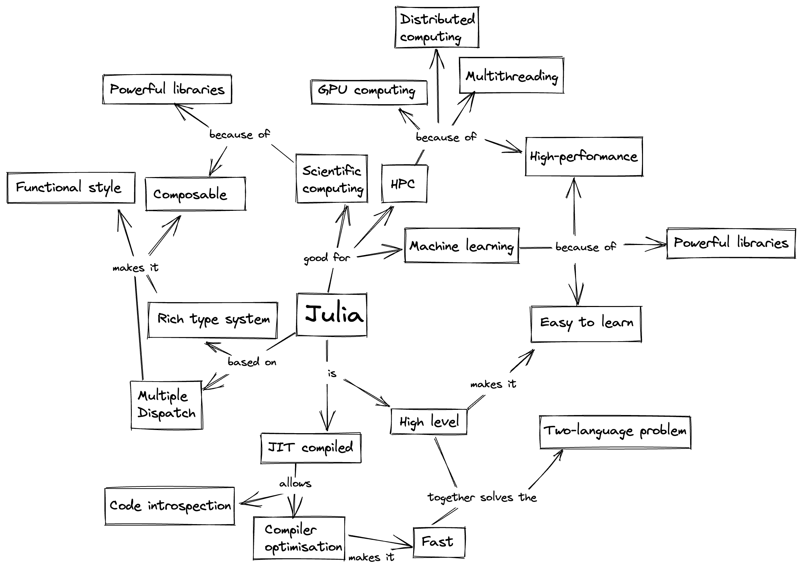

# Parallel computing and GPU programming with Julia

**Abstract**: The Julia programming language is being increasingly adopted in High Performance Computing (HPC) due to its unique way to combine performance with simplicity and interactivity, enabling unprecedented productivity in HPC development.
In this workshop, we provide an overview of HPC with Julia and cover three types of parallel computations:
- Multi-threading: the ability to schedule tasks simultaneously on more than one thread or CPU core, sharing memory (the easiest way to parallelize on shared-memory systems);
- Multi-processing and distributed computing: the ability to run multiple Julia processes with separate memory spaces on the same or multiple computers;
- GPU programming: how to port a computational procedure to a graphical processing unit (GPU) via either high-level or low-level programming.

**Notebooks**:
- Introduction: [Julia](https://amontoison.github.io/Workshop-GERAD/introduction_julia.html)
- Background: [Parallel computing](https://amontoison.github.io/Workshop-GERAD/parallel_computing.html)
- Part I: [Multi-threading](https://amontoison.github.io/Workshop-GERAD/multithreading.html)
- Part II: [Multi-processing and distributed computing](https://amontoison.github.io/Workshop-GERAD/distributed_computing.html)
- Part III: [GPU programming](https://amontoison.github.io/Workshop-GERAD/gpu_programming.html)

# Additional tutorials

- GPU Workshop material: [JuliaCon 2021](https://github.com/maleadt/juliacon21-gpu_workshop)
- Advanced GPU Computing training: [cscs2023](https://github.com/maleadt/cscs2023)
- An introduction to Julia for HPC: [JuliaUCL24](https://github.com/carstenbauer/JuliaUCL24)
- Talks of Valentin Churavy: [website](https://vchuravy.dev/talks/)
